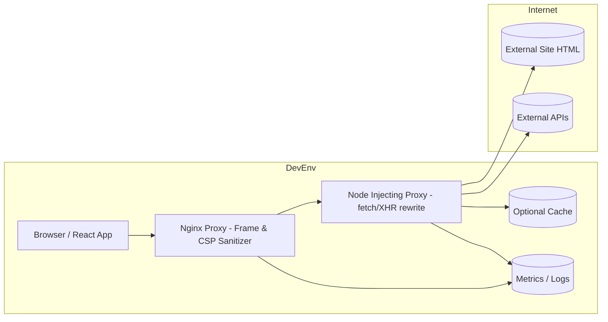

# Hybrid Proxy Architecture

This document describes a hybrid approach combining an edge Nginx (or Traefik) layer with a Node-based injecting proxy to enable embedding and subresource rewriting for external sites inside the application.

## Diagram



## Rationale

- Separation of Concerns: Nginx focuses on fast header manipulation (strip X-Frame-Options, normalize CSP, add CORS) and TLS/offloading. Node focuses on dynamic HTML/JS transformations that are cumbersome in pure Nginx.
- Reliability: If injection fails or crashes, Nginx can still pass through responses (feature flags to bypass injection via query parameter).
- Observability: Central metrics/log sink collects structured logs from both layers.
- Extensibility: Add caching or rate limiting at the edge without coupling to transformation logic.

## Request Flow

1. Browser iframe/page request goes to Nginx at `/proxy?url=...`.
2. Nginx validates the URL (basic protocol / allowlist), strips frame-blocking headers, sets baseline CSP `frame-ancestors *`, disables upstream compression for HTML to allow downstream injection, and forwards to the Node injecting proxy.
3. Node proxy fetches upstream, performs streaming HTML injection (rewriting fetch/XHR URLs to route through itself), adjusts headers, and streams back.
4. Nginx returns the transformed response to the browser.
5. Subsequent subresource calls (JS fetch/XHR) are rewritten to hit Node again (still via Nginx frontend) allowing consistent CORS and header sanitation.

## Components

- Nginx / Traefik Edge:
  - Strip / override X-Frame-Options & frame-ancestors.
  - Basic URL allowlist & scheme validation.
  - Add permissive dev CORS & CSP frame-ancestors.
  - Disable compression for HTML (if injection needed).
- Node Injecting Proxy (`server/proxy.js`):
  - Dynamic target resolution.
  - Streaming HTML modification with injection snippet.
  - Optional flags (?raw, ?allowCookies) for debugging.
  - Detailed request lifecycle logging & timeouts.
- Optional Cache: Memory / Redis for small immutable assets (favicons, logos, CSS) to reduce upstream calls.
- Metrics / Logs: Could be Loki/Promtail, Elasticsearch, or simple JSON file sink.

## Deployment (Dev Stack)

```text
[ Browser ] -> http://localhost:8080/proxy?url=... (Nginx)
         |
         v
       http://node:3001/proxy?url=... (Node)
         |
         v
     https://remote-external-site
```

### Docker Compose Example

```yaml
services:
  edge:
    image: openresty/openresty:alpine
    ports:
      - "8080:8080"
    volumes:
      - ./proxy-nginx/nginx.conf:/usr/local/openresty/nginx/conf/nginx.conf:ro
    depends_on:
      - injector
  injector:
    build: .
    command: node server/proxy.js
    environment:
      - LOG_LEVEL=info
    ports:
      - "3001:3001" # optional direct access
```

### Nginx Forwarding Stub (Concept)

```nginx
location /proxy {
  # sanitize + header logic (see proxy-nginx/nginx.conf)
  proxy_pass http://injector:3001$request_uri;
}
```

## Feature Flags

- `?raw` (skip HTML injection; debugging plain upstream).
- `?allowCookies` (retain Set-Cookie headers for scenarios needing session simulation).
- Edge env var (future): `ALLOW_PROXY_HOSTS` for allowlist.

## Failure Modes & Mitigations

| Failure | Layer | Mitigation |
|---------|-------|------------|
| Upstream slow/hangs | Node | Pending timer + timeout -> 504 |
| Injection script not inserted | Node | Watchdog inject at end; `?raw` toggle to compare |
| Header still blocks iframe | Edge | Forced CSP & X-Frame-Options removal; double-sanitization guard |
| Large compressed HTML not injectable | Edge | Remove Accept-Encoding when forwarding if `inject=1` flag present |
| Google / hardened site breaks inside iframe | Both | Domain-specific bypass or screenshot fallback |

## Extending

- Add Lua body filter in Nginx to pre-process or partially inline critical rewrites before Node (reduces transformation burden).
- Introduce response signature hashing in Node to detect dynamic reload loops.
- Implement service worker suppression (strip Service-Worker-Allowed & related headers) to avoid cross-origin caching anomalies.

## Security (Dev Only)

This setup is deliberately permissive. Do NOT deploy to production without:

- Strict host allowlist & TLS enforcement.
- Removal of Access-Control-Allow-Origin: * (use exact origins).
- Disabled injection or audited safe transforms.
- Authentication on the proxy endpoints.

## Roadmap

1. Add allowlist enforcement to Nginx (map + regex validation).
2. Add optional Redis cache for small assets.
3. Convert Node logging to structured JSON + forward via UDP/HTTP to sink.
4. Implement bidirectional WebSocket support (if needed) with selective injection bypass.

---
Generated initial version; adapt as architecture evolves.
